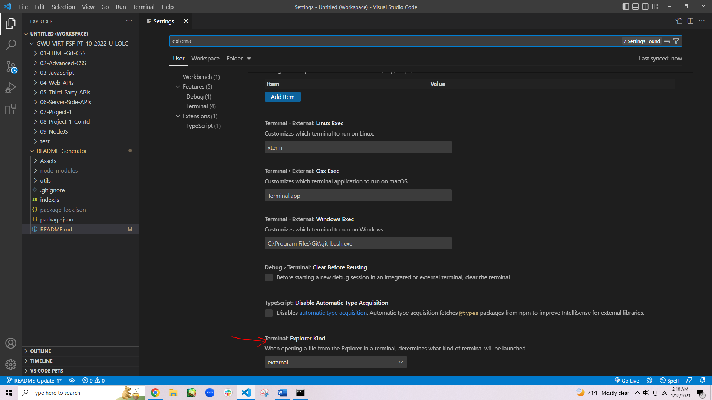

# Team Profile Generator
  
  ## Description

  This project is a Node.js command-line application that generates an HTML page for a team of employees with a summary of each team member based on user input.
  
  ## Table of Contents
  - [Installation](#installation)
  - [Usage](#usage)
  - [How to contribute](#how-to-contribute)
  - [Credits](#credits)
  - [Test Instructions](#test-instructions)
  - [Questions](#questions)

  ## Installation

  Make sure the following are downloaded:

  ### `Git/GitBash` - *Strongly Recommended*
  * While this application can be run using with the default **command prompt**, it is easier to clone this repository by using Git/GitBash, which can be downloaded for free [here](https://git-scm.com/downloads).

  ### `Visual Studio Code [VSC]` - *Strongly Recommended*

  * If you'd like to make changes to this code or the README file generated, Visual Studio Code is recommended and can be downloaded for free [here](https://code.visualstudio.com/download).

  ### `Node version 16` - **REQUIRED** to generate files and utilize dependencies
  * Go to [Node's homepage, https://nodejs.org/en/](https://nodejs.org/en/), then [Downloads](https://nodejs.org/en/download/) and scroll down to the [Previous Releases](https://nodejs.org/en/download/releases/) bullet point. 

  * Toggle between the results until the desired version 16 package and click Download. This application was developed with [Node.js version 16.18.0](https://nodejs.org/dist/v16.18.0/), click on [node-v16.18.0-x64.msi](https://nodejs.org/download/release/v16.18.0/node-v16.18.0-x64.msi) to download.

  * The Full-Stack Blog also has [instructions on how to download Node](https://coding-boot-camp.github.io/full-stack/nodejs/how-to-install-nodejs).

  ### `Inquirer version 8.2.4` - **REQUIRED** to prompt questions

  * This **MUST** be installed into this repository, start by opening the command line interface.

  * If you have Visual Code Studio, add the README Generator repository to the workspace. Then, go to 'Settings' either through the cog icon in the lower left corner and clicking Settings, go to File -> Preferences -> Settings in the menu bar, or the key combo of Ctrl+,

  * Then, change the settings in "Terminal: Explorer Kind" to "external" in the drop down menu.

  
          
  * Change the filepath of the "Terminal > External: [respective operating system]" settings to the preferred command line interface program (either your system's Command Prompts's file path or Git/Git Bash's file path)

  

  * After that, right-click the repository and select "Open in External Terminal"

  

  

  * If you do not have VSC, open the preferred terminal.

  * Use "cd Desktop" to first reach the Desktop, cd stands for change directory.

  * Continue using "cd" to navigate through the file path to reach the location of this repository on your computer.

  

  * Once this repository has been reached, type in `npm i inquirer@8.2.4` into the terminal and hit `Enter`.

  ### `Jest version 8.2.4` - **REQUIRED** for testing
  
  * Follow the same methods from [Inquirer v8.2.4 Installation Section](#inquirer-version-824---required-to-prompt-questions) to reach this repository if you've already exited out of the command-line, then type in `npm i jest` and hit `Enter`.

  ## Usage
  * A video of this application's usage can be viewed [here](https://drive.google.com/file/d/1pbLwfHMrcf_RUMx4d5a3OQEtI1hKC_xq/view). If the link is non-functional, a copy of the video can be found in the "Assets" folder.

  * To use this application, start by using either of the two methods described in the [Inquirer v8.2.4 Installation Section](#inquirer-version-824---required-to-prompt-questions) to reach this repository through the preferred terminal.

  Method 1:
  

  

  Method 2:

  

  * Once this repository has been reached, type in `node index.js` into the terminal and hit `Enter`. This will start the questions prompt. Answer the questions as according to the project in question.
  

  
  ## How to contribute
  

  ## Credits
  * Card template provided by [Bootstrap](https://getbootstrap.com/):   https://getbootstrap.com/docs/5.3/components/card/
  
  * Nav bar template provided by [Bootstrap](https://getbootstrap.com/):   https://getbootstrap.com/docs/5.3/components/navbar/
  
  * Changing nav bar color information provided by [Bootstrap](https://getbootstrap.com/):   https://getbootstrap.com/docs/5.3/customize/color/
  
  * Changing text information provided by [Bootstrap](https://getbootstrap.com/):   https://getbootstrap.com/docs/5.3/utilities/text/#text-alignment
  
  * Badge template provided by [Bootstrap](https://getbootstrap.com/):   https://getbootstrap.com/docs/5.3/components/badge/
  
  * Changing badge color and text color information provided by [Bootstrap](https://getbootstrap.com/):   https://getbootstrap.com/docs/5.3/utilities/colors/
  
  * List group template provided by [Bootstrap](https://getbootstrap.com/):   https://getbootstrap.com/docs/5.3/components/list-group/
  
  * Sending email through HTML anchor information provided by [W3docs](https://www.w3docs.com/):   https://www.w3docs.com/snippets/html/how-to-create-mailto-links.html
  
  * Javascript subclass 'extends' keyword supplemental lesson provided by [W3Schools](https://www.w3schools.com/):   https://www.w3schools.com/jsref/jsref_class_extends.asp#:~:text=The%20extends%20keyword%20is%20used,you%20create%20a%20new%20class.
  
  * Including 'https://' before 'www.(website).com' to denote the URL is a full or absolute URL information provided by [W3 Schools](https://www.w3schools.com/):   https://www.w3schools.com/html/html_links.asp
  
  * :   [link]
  
  * :   [link]
  
  * :   [link]
  
  * :   [link]
  
  * :   [link]
  
  * :   [link]
  
  * :   [link]

  ## Test Instructions

  To run a test, use the command line to reach this repository and invoke Jest's testing capabilities with `npm test` or `npm run test`, all four tests will be ran. Again, make sure you have jest installed with first.
    
  ## Questions
  
  If you have any questions, my GitHub profile is [www.github.com/leeclaire156](www.github.com/leeclaire156), and my email is [lee.claire156@gmail.com](mailto:lee.claire156@gmail.com).